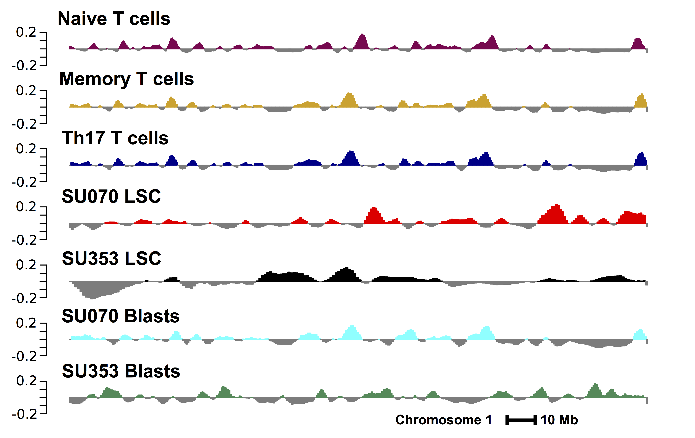
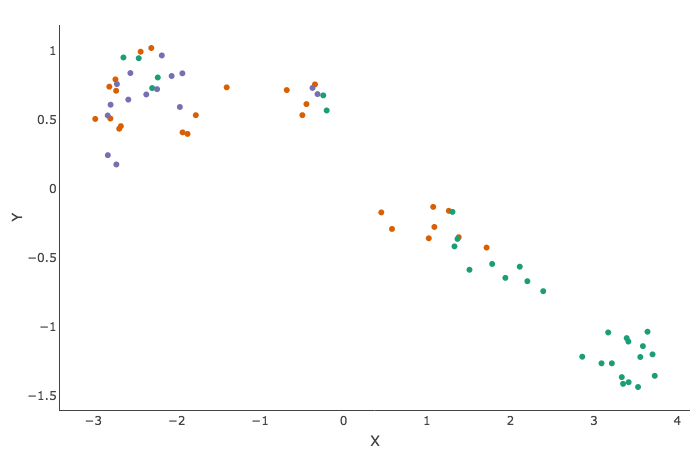

# Compartmap 


# Compartmap: chromatin compartments from DNA methylation, ATACseq, and RNAseq 

[](https://travis-ci.org/biobenkj/compartmap)  [](https://codecov.io/gh/biobenkj/compartmap)

## How to install

```
devtools::install_github("trichelab/compartmap")
# or:
install.packages("BiocManager")
BiocManager::install("trichelab/compartmap")
```

Compartmap extends methods to perform A/B compartment inference from (sc)ATAC-seq and methylation arrays originally proposed by Fortin and Hansen 2015, Genome Biology (https://genomebiology.biomedcentral.com/articles/10.1186/s13059-015-0741-y). Originally, Fortin and Hansen demonstrated that chromatin conformation could be inferred from (sc)ATAC-seq, bisulfite sequencing, DNase-seq and methylation arrays, similar to the results provided by HiC. Thus, in addition to the base information provided by the aforementioned assays, chromatin state could also be inferred. However, these data were restricted to group level A/B compartment inference.

Here, we propose a method to infer sample-level chromatin state, thus enabling (un)supervised clustering of samples/cells based on A/B compartments. To accomplish this, we employ a shrinkage estimator towards a global or targeted mean, using either chromsome or genome-wide information from ATAC-seq and methylation arrays (e.g. Illumina 450k or EPIC arrays). The output from compartmap can then be embedded and visualized using your favorite clustering approach, such as UMAP/tSNE.

## Quick Start

### Input
The expected input for compartmap is either a RangedSummarizedExperiment object or GenomicRatioSet object. These can be built using packages like [ATACseeker](https://github.com/biobenkj/ATACseeker) or [SeSAMe](https://www.bioconductor.org/packages/devel/bioc/html/sesame.html). 

```

library(compartmap)

#Load in some example methylation array data
#This data is derived from https://f1000research.com/articles/5-1281/v3
data(meth_array_450k_chr14, package = "compartmap")

```

### Processing data

To process the data (filter and perform compartment inference) a wrapper function is used for all data types.

```

#Process chr14 of the example data
#Note: running this in parallel is memory hungry!

array_compartments <- getCompartments(array.data.chr14, type = "array", parallel = FALSE, chrs = "chr14")

```

### Ouput and post-processing

Once the data have been processed, the object returned is a matrix of sample-level A/B compartments (samples as columns and compartments as rows). These are normalized to chromosome length and each compartment corresponds to a non-empty bin (based on the desired resolution - 1 Mb is the default). From here, the data can be visualized using something like plotAB for individual samples or your favorite clustering method. Additionally, these can be overlaid in something like IGV to see where compartments are changing between samples/conditions. 

```

#Plotting individual samples
#For 7 samples
#Adjust ylim as necessary
par(mar=c(1,1,1,1))
par(mfrow=c(7,1))
plotAB(array_compartments[,1], ylim = c(-0.2, 0.2), unitarize = TRUE)
plotAB(array_compartments[,2], ylim = c(-0.2, 0.2), unitarize = TRUE, top.col = "goldenrod")
plotAB(array_compartments[,3], ylim = c(-0.2, 0.2), unitarize = TRUE, top.col = "darkblue")
plotAB(array_compartments[,4], ylim = c(-0.2, 0.2), unitarize = TRUE, top.col = "red")
plotAB(array_compartments[,5], ylim = c(-0.2, 0.2), unitarize = TRUE, top.col = "black")
plotAB(array_compartments[,6], ylim = c(-0.2, 0.2), unitarize = TRUE, top.col = "cyan")
plotAB(array_compartments[,7], ylim = c(-0.2, 0.2), unitarize = TRUE, top.col = "seagreen")

#Embed with UMAP for unsupervised clustering
library(uwot)
embed_compartments <- umap(t(array_compartments), n_neighbors = 3, metric = "manhattan", n_components = 5, n_trees = 100)

#Visualize embedding
library(vizier)
library(plotly)
embed_plotly(embed_compartments, tooltip = colnames(embed_compartments), show_legend = FALSE)

```

### Example of individual sample compartment visualization



### Example of UMAP'd ATAC-seq data from HDAC inhibitor treated Sezary syndrome patient samples


